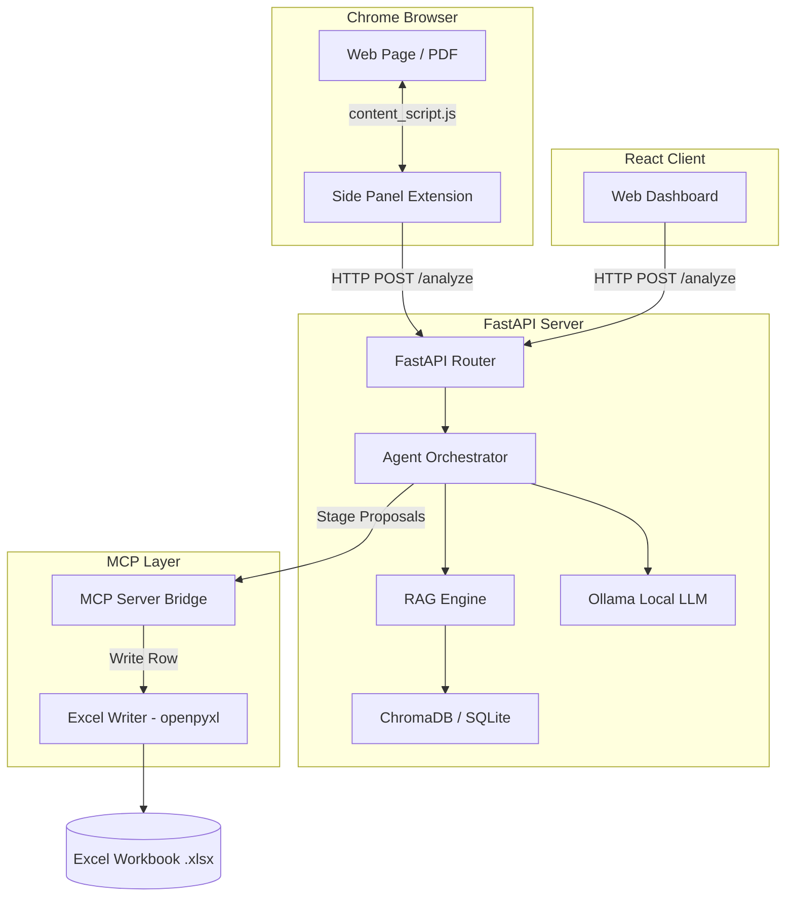

# SheetPilot AI

SheetPilot AI is a privacy-first, local AI-powered co-pilot designed to automate manual data entry from webpages, portals, and digital invoices directly into Excel workbooks.

---

## 📌 Problem Statement

In logistics, accounting, and supply chain management, operators spend hours copy-pasting data from supplier portals, PDFs, emails, and invoices into Excel spreadsheets. This manual process is:
- **Time-Consuming**: Hundreds of invoices or vendor pages must be individually processed daily.
- **Error-Prone**: Human typists frequently misspell names, swap digits in tax IDs, or misalign cells.
- **Privacy-Critical**: Sensitive business transactions and customer information are often sent to cloud-based LLM APIs, posing data security and compliance risks.

---

## 💡 Proposed Solution

**SheetPilot AI** solves this by introducing a local, privacy-first data extraction assistant:
1. **Local LLM & RAG**: Uses a local instance of Ollama (`llama3.1:8b`) combined with a Retrieval-Augmented Generation (RAG) pipeline to parse, chunk, and search webpage data securely on your local machine.
2. **Dynamic Mapping**: Automatically matches column headers from your target Excel sheet to information found on the current browser tab.
3. **Interactive Side Panel**: Allows users to review, edit, and confirm extracted data with clear confidence scores (Green, Amber, Red badges) before writing to the sheet.
4. **Unified Protocol (MCP)**: Implements Model Context Protocol (MCP) servers to cleanly isolate backend data sources and Excel spreadsheet read/write operations.
5. **Vite Dashboard**: Provides a comprehensive web interface to manage workbooks, view analysis history, adjust extraction settings, and run direct analysis.
WebApp Solution


---

## 🛠 System Architecture



---

## 📁 Folder Structure

```
sheetpilot-ai/
├── backend/                  # FastAPI Application Source
│   ├── agent/                # Orchestrator agent coordinating RAG, LLM, and MCP
│   ├── db/                   # Database models & history schemas (SQLite)
│   ├── llm/                  # Prompts and local Ollama interface wrapper
│   ├── mcp/                  # MCP Excel servers and tool clients
│   ├── models/               # Pydantic schemas for API requests & responses
│   ├── rag/                  # Chunker, Embedder (sentence-transformers), and Retriever
│   ├── tests/                # System integration and unit tests
│   └── main.py               # Backend server entrypoint
│
├── extension/                # Chrome Extension (Manifest V3)
│   ├── icons/                # Extension logos & icons
│   ├── background.js         # Handles sidepanel action and state
│   ├── content_script.js     # Extracts text and page content from active tab
│   ├── panel.html            # Sidebar UI layout
│   └── panel.js              # Sidebar interaction and backend communication logic
│
├── webapp/                   # React web application (Vite + React)
│   ├── src/
│   │   ├── components/       # Layouts, Sidebar, Toast components
│   │   ├── pages/            # Dashboard, History, Analyze, Settings, Workbooks
│   │   ├── App.jsx           # App routing & context setup
│   │   └── api.js            # Axios client mapping backend endpoints
│   ├── vite.config.js        # Vite compilation configuration
│   └── package.json          # Node dependencies list
│
├── sample_data/              # Sample spreadsheets for testing
│   └── vendor_invoice.xlsx   # Standardized template invoice table
│
├── requirements.txt          # Python dependency specifications
├── mcp_config.json           # Model Context Protocol server configuration
├── .env.example              # Environment variables template
└── SETUP.md                  # Comprehensive step-by-step setup guide
```

---

## 🔄 Detailed Workflow

1. **Extraction**: The user opens a webpage (e.g., an invoice page or supplier site) and clicks the **🔍 Analyze This Page** button in the extension side panel.
2. **Content Script Parsing**: The extension's `content_script.js` extracts all readable text content, handles layout spacing, and sends the raw payload to the backend `/analyze` endpoint.
3. **RAG Indexing**:
   - The text is chunked using a semantic overlap window (`chunker.py`).
   - Text chunks are converted to vectors using a lightweight local embedding model (`embedder.py`).
   - Relevant text passages are retrieved using vector similarity relative to the target column headers (`retriever.py`).
4. **LLM Extraction**: The backend feeds the relevant text passages and system prompt to Ollama. The local model extracts matching data for each Excel header.
5. **Confidence Scoring**: The backend compares extracted values to source snippets, calculating confidence scores (High, Medium, Low) and staging the proposals in memory.
6. **Review & Edit**: The user reviews proposed mappings in the sidebar. Any fields requiring adjustments can be typed into directly.
7. **Commit & Sync**: Clicking **✓ Approve & Sync** sends the values to the MCP Excel server, which opens the local `.xlsx` workbook using `openpyxl`, writes the new row, and saves the file.

---

## 🚀 Getting Started

To install, configure, and run SheetPilot AI on your local machine, please follow the detailed steps in the **[SETUP.md](file:///c:/Users/SohamVaghela/Downloads/L2_Project/sheetpilot-ai/SETUP.md)** file.
